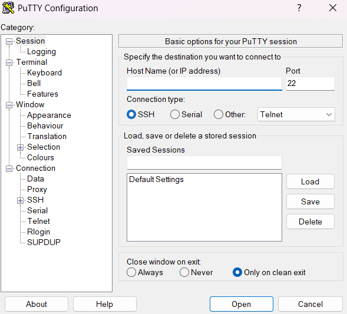

# Raspberry Pi Epaper Photo Frame

This project displays photos on a Epaper photo frame using a connected Raspberry Pi Zero. 
This repo holds both the onboard software for the Pi and the script to move photos through wifi from a computer to the Pi.

## Getting Started

### Cloning

```bash
git clone https://github.com/decmccoy/epaper_project.git
```

### File Structure

Onboard Pi files:
```bash
├── main_loop.py
└── logger.py
```
Image transfer script files:
```bash
├── epaper
│   ├── load_photos_to_pi.py
│   ├── conversion_util.py
│   ├── file_transfer_util.py
├── EXAMPLE_raspberry_pi_info.json
└── EXAMPLE_downloaded_photos.zip
```

### Setting up the Raspberry Pi

#### Dependancies

- [Thonny](https://thonny.org/)
- [Raspberry Pi OS](https://www.raspberrypi.com/software/)
- [PuTTY](https://www.chiark.greenend.org.uk/~sgtatham/putty/latest.html)

#### Steps

To image the micro SD card, plug it into a computer and make the following selections:<br/>
<br/>
Click `NEXT`, then `EDIT SETTINGS`:<br/>
<br/>
- Set your own username and password, and select the `Configure wireless LAN` to enter your wifi credentials
    > ⚠️ Don't forget these values

Select Enable SSH:<br/>
<br/>
- Then press `SAVE` and insert the micro SD into the Pi
- Plug in your Pi, and wait for the green LED to stop blinking. The first time you do this, it may take up to 10 minutes, so be patient

Open PuTTY and enter the host name of the Pi:<br/>
<br/>
- Click `Open`, and enter your username and password

Enable Spi by opening the Raspberry Pi configuration:
```bash
sudo raspi-config
```
- Then navigate to `Interfacing Options` -> `SPI` and make sure it is enabled

Create the project folder:
```bash
cd Documents
mkdir epaper_proj
```
Run the following commands to download and unpack the waveshare package:
```bash
git clone https://github.com/waveshare/e-Paper.git
cd e-Paper/RaspberryPi_JetsonNano/python
sudo apt-get install python3-pip libopenjp2-7 libtiff5
sudo python3 setup.py install
```
Finally, use Thonny to move the onboard python files to the Pi and run `main_loop.py`

### Executing the script

- Download all the photos as a zip file and place it in the base directory of the project
- Create the `raspberry_pi_info.json` to hold the Pi host_name, username and password
- Run the following command in the terminal in the base directory:
```bash
python3 epaper/load_photos_to_pi.py
```

## Authors

- [decmccoy](https://github.com/decmccoy)
- [darcymccoy](https://github.com/darcymccoy)
